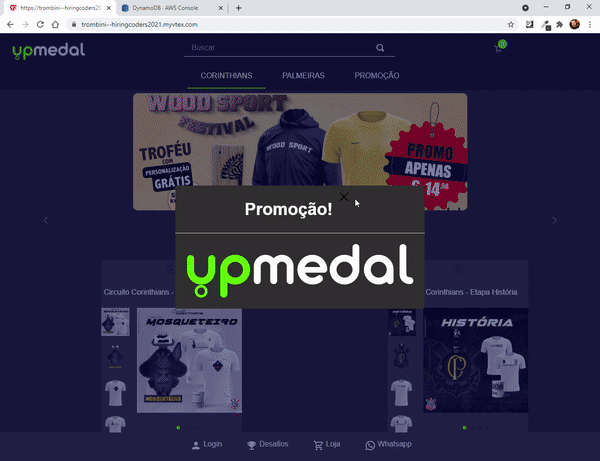
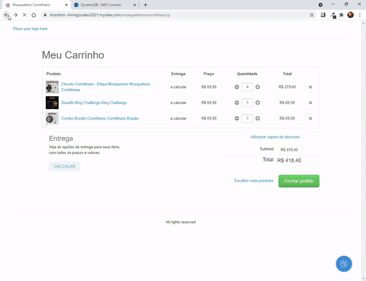

<h1 align="center">
  Upmedal
</h1>

  <a href="https://www.linkedin.com/feed/update/urn:li:activity:6835611298382905344/">Live</a>&nbsp;&nbsp;&nbsp;|&nbsp;&nbsp;&nbsp;
  <a href="#-tecnologias">Tecnologias</a>&nbsp;&nbsp;&nbsp;|&nbsp;&nbsp;&nbsp;
  <a href="#-projeto">Projeto</a>&nbsp;&nbsp;&nbsp;|&nbsp;&nbsp;&nbsp;
  <a href="#-layout">Layout</a>&nbsp;&nbsp;&nbsp;|&nbsp;&nbsp;&nbsp;
  <a href="#memo-licença">Licença</a>

 

  

 

  

  

# 💻 Projeto

É uma reprodução do site e-commerce www.upmedal.com.br feita com VTEX.IO e adicionando uma captura de leads salvando os dados em uma API Gateway da AWS com DynamoDB. Foi feito como desafio da segunda fase do programa HiringCoders em parceria com VTEX e AWS.

## 🚀 Tecnologias:

VTEX.IO -
TypeScript -
NodeJS -
React -
DynamoDB -
AWS Amplify -
AWS API Gateway -
CSS -

### Endereço

https://trombini--hiringcoders2021.myvtex.com/

### Assistir um video demonstrativo

https://www.linkedin.com/feed/update/urn:li:activity:6835611298382905344/

## :memo: Licença

Esse projeto está sob a licença MIT. Veja o arquivo [LICENSE](LICENSE.md) para mais detalhes.

---

## Author:

* **Leandro Trombini** - [LinkedIn](https://www.linkedin.com/in/leandrotrombini/)

